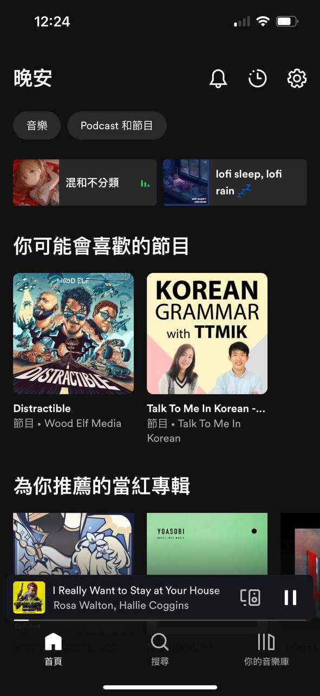
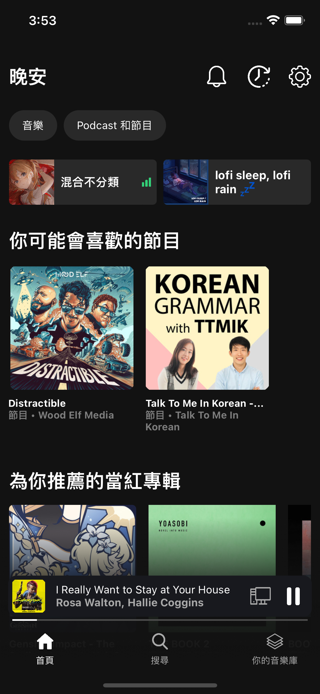

# iOS-App-Dummy

## Introduction
The goal of this assignment is to use SwiftUI to make a static page similar to Spotify as much as possible.

Medium: https://medium.com/@roy23381547/01-%E4%BB%BF%E9%80%A0%E4%B8%80%E9%A0%81-spotify-%E7%95%AB%E9%9D%A2-f7e6d7e66f5

## Result

The left picture is a screenshot of Spotify.  
The right picture is an imitation of Spotify's UI using SwiftUI.

    
    &nbsp;&nbsp;&nbsp;&nbsp;&nbsp;
    

## icon
<a href="https://www.flaticon.com/free-icons/notification" title="notification icons">Notification icons created by ghufronagustian - Flaticon</a>

<a href="https://www.flaticon.com/free-icons/watch" title="watch icons">Watch icons created by Freepik - Flaticon</a>

<a href="https://www.flaticon.com/free-icons/settings" title="settings icons">Settings icons created by Freepik - Flaticon</a>

<a href="https://www.flaticon.com/free-icons/pause" title="pause icons">Pause icons created by Debi Alpa Nugraha - Flaticon</a>

<a href="https://www.flaticon.com/free-icons/album" title="album icons">Album icons created by Freepik - Flaticon</a>

<a href="https://www.flaticon.com/free-icons/home" title="home icons">Home icons created by Freepik - Flaticon</a>

<a href="https://www.flaticon.com/free-icons/search" title="search icons">Search icons created by Smashicons - Flaticon</a>

<a href="https://www.flaticon.com/free-icons/computer" title="computer icons">Computer icons created by Freepik - Flaticon</a>

<a href="https://www.flaticon.com/free-icons/signal" title="signal icons">Signal icons created by Karacis - Flaticon</a>
